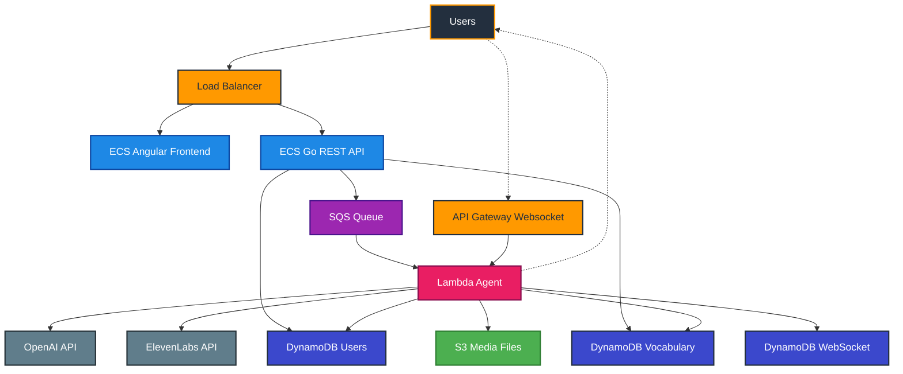

# WordWeaveAI Architecture

```mermaid
graph TB
    A1["Users"]
    B["Load Balancer"]
    C["API Gateway Websocket"]
    A["ECS Angular Frontend"]
    D["ECS Go REST API"]
    E["SQS Queue"]
    F["Lambda Agent"]
    H["DynamoDB Users"]
    I["S3 Media Files"]
    J["DynamoDB WebSocket"]
    K1["DynamoDB Vocabulary"]
    K["OpenAI API"]
    L["ElevenLabs API"]

    %% Flow connections
    A1 --> B
    A1 -.-> C
    B --> A
    B --> D
    D --> E
    D --> H
    D --> K1
    E --> F
    F --> K
    F --> L
    F --> H
    F --> I
    F --> K1
    F --> J
    C --> F
    F -.-> A1

    %% AWS Styling
    style A1 fill:#232f3e,stroke:#ff9900,stroke-width:2px,color:#ffffff
    style A fill:#1e88e5,stroke:#0d47a1,stroke-width:2px,color:#ffffff
    style B fill:#ff9900,stroke:#232f3e,stroke-width:2px,color:#232f3e
    style C fill:#ff9900,stroke:#232f3e,stroke-width:2px,color:#232f3e
    style D fill:#1e88e5,stroke:#0d47a1,stroke-width:2px,color:#ffffff
    style E fill:#9c27b0,stroke:#4a148c,stroke-width:2px,color:#ffffff
    style F fill:#e91e63,stroke:#880e4f,stroke-width:2px,color:#ffffff
    style H fill:#3b48cc,stroke:#232f3e,stroke-width:2px,color:#ffffff
    style I fill:#4caf50,stroke:#2e7d32,stroke-width:2px,color:#ffffff
    style J fill:#3b48cc,stroke:#232f3e,stroke-width:2px,color:#ffffff
    style K1 fill:#3b48cc,stroke:#232f3e,stroke-width:2px,color:#ffffff
    style K fill:#607d8b,stroke:#263238,stroke-width:2px,color:#ffffff
    style L fill:#607d8b,stroke:#263238,stroke-width:2px,color:#ffffff
```
