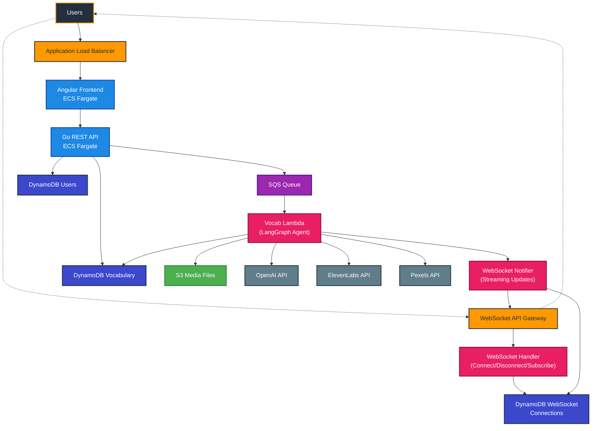

# WordWeaveAI Architecture

## Architecture Flow

### 1. New Vocabulary Request

- User submits request via Angular frontend → Go REST API → SQS Queue
- **Vocab Lambda** function polls the SQS Queue and runs a LangGraph agent

### 2. Real-time WebSocket Updates

- **WebSocket Handler** manages connections and subscriptions
- **WebSocket Notifier** streams live updates during processing:
  - `processing_started`, `chunk_update`, `processing_completed`, `ddb_hit`, `processing_failed`
- Multiple users can subscribe to the same vocabulary word to get near real time updates of the execution flow

### 3. Data Management

- We use DynamoDB for storing User, Vocabulary and WebSocket connections data
- API calls to OpenAI, Elevenlabs, and Pexels are made to get text, audio and image data respectively
