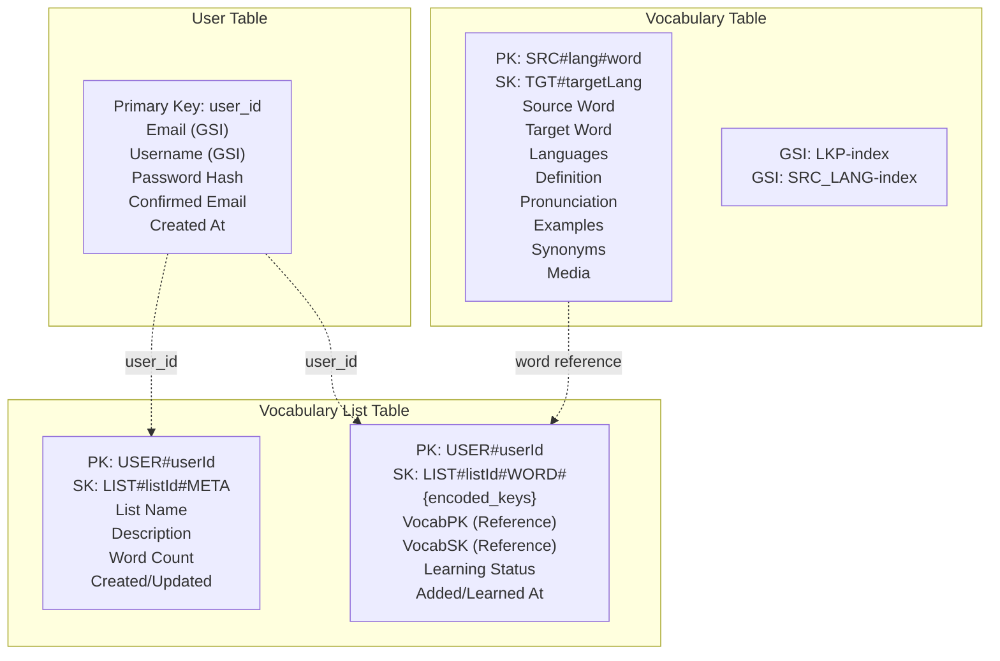

# WordWeave REST API

Vocabulary learning REST API built with Go, Gin, and DynamoDB. Users can search vocabulary translations and manage learning lists.

## Database Architecture

Three DynamoDB tables using hybrid design approach:

### Table Structure

## Key Design Patterns

### User Table (Traditional)

- Primary Key: user_id
- GSI EmailIndex: Hash=email, Range=user_id
- GSI UsernameIndex: Hash=username, Range=user_id
- Purpose: User authentication and profile management

### Vocabulary Table (Single-table)

- Primary Key: SRC#{language}#{normalized_word} (e.g., SRC#en#hello)
- Sort Key: TGT#{target_language} (e.g., TGT#es)
- GSI-1 ReverseLookupIndex: PK=LKP#{target_lang}#{target_word}, SK=SRC_LANG
- GSI-2 EnglishMediaLookupIndex: PK=english_word (for media reuse)
- Purpose: Centralized vocabulary storage with rich metadata and reverse lookup capability

### Vocabulary List Table (Single-table with META pattern)

- List Metadata: PK=USER#{userId}, SK=LIST#{listId}#META
- List Words: PK=USER#{userId}, SK=LIST#{listId}#WORD#{wordId}
- Purpose: Atomic word count updates and efficient queries

## Search Strategy

When users search for vocabulary without specifying languages, the system uses a **4-tier search approach**:

1. **Direct PK Queries**: Search `SRC#{lang}#{word}` across all supported languages (fastest)
2. **Reverse Lookup GSI**: Search `LKP#{target_lang}#{word}` to find source translations
3. **English Word GSI**: Search `english_word` index for English vocabulary entries
4. **Partial Match Scan**: Fallback scan with filters for partial word matching (slowest)
