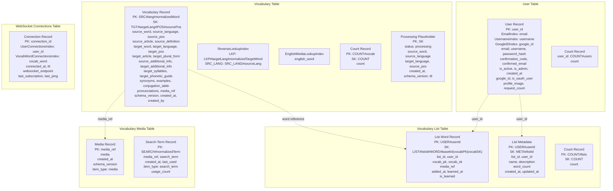

# WordWeave REST API

Vocabulary learning REST API built with Go, Gin, and DynamoDB. Users can search vocabulary translations and manage learning lists.

## Database Architecture

Four core DynamoDB tables using a hybrid design approach. The Python agent owns vocabulary/media writes, while this REST API primarily reads vocabulary, enriches responses, and manages users/lists.

### Table Structure

```mermaid
graph TB
    subgraph "User Table"
        U1["User Record<br/>PK: user_id<br/>EmailIndex: email<br/>UsernameIndex: username<br/>GoogleIDIndex: google_id<br/>email, username, password_hash<br/>confirmation_code, confirmed_email<br/>is_active, is_admin, created_at<br/>google_id, is_oauth_user<br/>profile_image, request_count"]
        U2["Count Record<br/>user_id: COUNT#users<br/>count"]
    end

    subgraph "Vocabulary Table"
        V1["Vocabulary Record<br/>PK: SRC#lang#normalizedWord<br/>SK: TGT#targetLang#POS#sourcePos<br/>source_word, source_language, source_pos<br/>source_article, source_definition<br/>target_word, target_language, target_pos<br/>target_article, target_plural_form<br/>source_additional_info, target_additional_info<br/>target_syllables, target_phonetic_guide<br/>synonyms, examples, conjugation_table<br/>pronunciations, media_ref<br/>schema_version, created_at, created_by"]
        V2["ReverseLookupIndex<br/>LKP: LKP#targetLang#normalizedTargetWord<br/>SRC_LANG: SRC_LANG#sourceLang"]
        V3["EnglishMediaLookupIndex<br/>english_word"]
        V4["Count Record<br/>PK: COUNT#vocab<br/>SK: COUNT<br/>count"]
        V5["Processing Placeholder<br/>PK, SK<br/>status: processing<br/>source_word, source_language<br/>target_language, source_pos<br/>created_at, schema_version, ttl"]
    end

    subgraph "Vocabulary List Table"
        VL1["List Metadata<br/>PK: USER#userId<br/>SK: META#listId<br/>list_id, user_id<br/>name, description<br/>word_count<br/>created_at, updated_at"]
        VL2["List Word Record<br/>PK: USER#userId<br/>SK: LIST#listId#WORD#base64(vocabPK|vocabSK)<br/>list_id, user_id<br/>vocab_pk, vocab_sk<br/>media_ref<br/>added_at, learned_at<br/>is_learned"]
        VL3["Count Record<br/>PK: COUNT#lists<br/>SK: COUNT<br/>count"]
    end

    subgraph "Vocabulary Media Table"
        M1["Media Record<br/>PK: media_ref<br/>media<br/>created_at<br/>schema_version<br/>item_type: media"]
        M2["Search-Term Record<br/>PK: SEARCH#normalizedTerm<br/>media_ref, search_term<br/>created_at, last_used<br/>item_type: search_term<br/>usage_count"]
    end

    subgraph "WebSocket Connections Table"
        W1["Connection Record<br/>PK: connection_id<br/>UserConnectionsIndex: user_id<br/>VocabWordConnectionsIndex: vocab_word<br/>connected_at, ttl<br/>websocket_endpoint<br/>last_subscription, last_ping"]
    end

    U1 -.->|"user_id"| VL1
    U1 -.->|"user_id"| VL2
    V1 -.->|"word reference"| VL2
    V1 -.->|"media_ref"| M1
```

## Key Design Patterns

### User Table (Traditional)

- Primary Key: user_id
- GSI EmailIndex: Hash=email
- GSI UsernameIndex: Hash=username
- GSI GoogleIDIndex: Hash=google_id
- User fields: `user_id`, `email`, `username`, `password_hash`, `confirmation_code`, `confirmed_email`, `is_active`, `is_admin`, `created_at`, `google_id`, `is_oauth_user`, `profile_image`, `request_count`
- Count record: `user_id=COUNT#users`
- Count fields: `user_id`, `count`
- Purpose: User authentication, OAuth linking, profile management, and total user count

### Vocabulary Table (Single-table)

- Primary Key: `SRC#{source_language}#{normalized_word}` (e.g., `SRC#en#hello`)
- Sort Key: `TGT#{target_language}#POS#{source_pos}` (e.g., `TGT#es#POS#noun`)
- GSI-1 ReverseLookupIndex: Hash=`LKP#{target_language}#{normalized_target_word}`, Range=`SRC_LANG#{source_language}`
- GSI-2 EnglishMediaLookupIndex: Hash=`english_word`
- Vocabulary fields: `PK`, `SK`, `LKP`, `SRC_LANG`, `source_word`, `source_language`, `source_article`, `source_pos`, `source_definition`, `target_word`, `target_language`, `target_pos`, `target_article`, `target_plural_form`, `source_additional_info`, `target_additional_info`, `target_syllables`, `target_phonetic_guide`, `synonyms`, `examples`, `conjugation_table`, `pronunciations`, `media_ref`, `english_word`, `schema_version`, `created_at`, `created_by`
- Processing placeholder fields: `PK`, `SK`, `status`, `source_word`, `source_language`, `target_language`, `source_pos`, `created_at`, `schema_version`, `ttl`
- Count record: `PK=COUNT#vocab`, `SK=COUNT`
- Count fields: `PK`, `SK`, `count`
- The Python agent writes vocabulary records and increments this count when storing completed results
- Purpose: Centralized vocabulary storage with rich metadata and reverse lookup capability

### Vocabulary List Table (Single-table with META pattern)

- List Metadata: `PK=USER#{userId}`, `SK=META#{listId}`
- List metadata fields: `PK`, `SK`, `list_id`, `user_id`, `name`, `description`, `created_at`, `updated_at`, `word_count`
- List Words: `PK=USER#{userId}`, `SK=LIST#{listId}#WORD#{base64(vocabPK|vocabSK)}`
- List word fields: `PK`, `SK`, `list_id`, `user_id`, `vocab_pk`, `vocab_sk`, `media_ref`, `added_at`, `learned_at`, `is_learned`
- Count record: `PK=COUNT#lists`, `SK=COUNT`
- Count fields: `PK`, `SK`, `count`
- Purpose: Atomic word count updates and efficient queries

### Vocabulary Media Table

- Media records: `PK={media_ref}`
- Media fields: `PK`, `media`, `created_at`, `schema_version`, `item_type`
- Search records: `PK=SEARCH#{normalized_term}` with a `media_ref` pointer
- Search-term fields: `PK`, `media_ref`, `search_term`, `created_at`, `last_used`, `item_type`, `usage_count`
- The Python agent writes media records and search-term pointers for media reuse
- The REST API enriches vocabulary responses by fetching media directly with `media_ref`
- Purpose: Reuse and enrich vocabulary entries with media payloads

### WebSocket Connections Table

- Primary Key: `connection_id`
- GSI UserConnectionsIndex: Hash=`user_id`
- GSI VocabWordConnectionsIndex: Hash=`vocab_word`
- Connection fields: `connection_id`, `user_id`, `connected_at`, `ttl`, `websocket_endpoint`, `vocab_word`, `last_subscription`, `last_ping`
- Purpose: Track active WebSocket subscriptions for in-progress vocabulary generation

## Search Strategy

Search input is normalized to lowercase ASCII-like keys by applying Unicode normalization, transliterating German `ß` to `ss` and umlauts to `ae`/`oe`/`ue`, removing combining marks, and stripping non-alphanumeric characters. The original display words remain in `source_word` and `target_word`; normalized values are lookup keys only.

When users search for vocabulary without specifying languages, the system uses a **4-tier search approach**:

1. **Parallel Direct PK Queries**: Search `SRC#{lang}#{normalized_word}` across supported source languages (`en`, `es`, `de`)
2. **Parallel Reverse Lookup GSI Queries**: Search `LKP#{target_lang}#{normalized_word}` across supported target languages
3. **English Word GSI Query**: Search `english_word` for media/English-word reuse
4. **Partial Match Scan**: Fallback paginated scan with filters if indexed searches return no results

When source and/or target language is provided, the API first uses targeted key access:

- Source language: query `PK=SRC#{source_lang}#{normalized_word}`
- Source and target language: query the same PK with `SK begins_with TGT#{target_lang}`
- Target language only: query `ReverseLookupIndex` with `LKP#{target_lang}#{normalized_word}`

If targeted access returns no results, the API falls back to the 4-tier global search and filters the results by the requested source and/or target language.

## Cross-Service Notes

- `restapi` and the Python agent must use the same normalization rules for `PK`, `LKP`, `english_word`, and `SEARCH#` keys.
- Normalized keys intentionally collapse accents and punctuation, so distinct spellings can share a lookup bucket. The current item identity is still `PK + SK`, where `SK` includes target language and source POS.
- If same-language, same-target, same-POS homographs need to be stored separately later, add a sense or canonical-word discriminator to the sort key instead of changing the existing display fields.
