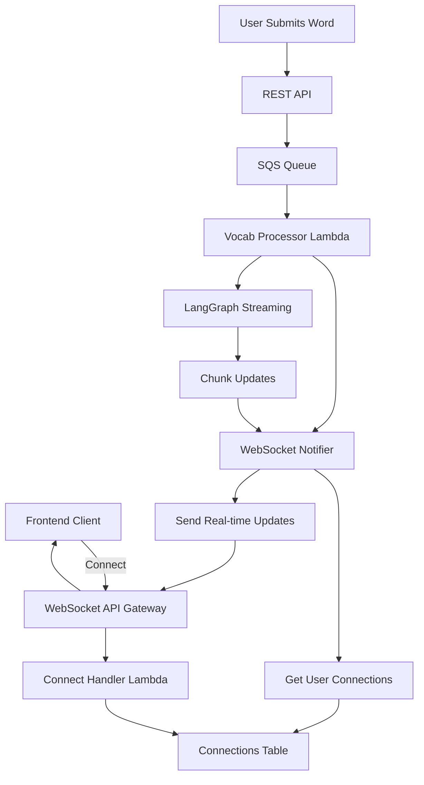

# Websocket Architecture

```mermaid
graph TD
A[Frontend Client] -->|Connect| B[WebSocket API Gateway]
B --> C[Connect Handler Lambda]
C --> D[Connections Table]

    E[User Submits Word] --> F[REST API]
    F --> G[SQS Queue]
    G --> H[Vocab Processor Lambda]

    H --> I[WebSocket Notifier]
    I --> J[Get User Connections]
    J --> D
    I --> K[Send Real-time Updates]
    K --> B
    B --> A

    H --> L[LangGraph Streaming]
    L --> M[Chunk Updates]
    M --> I
```
